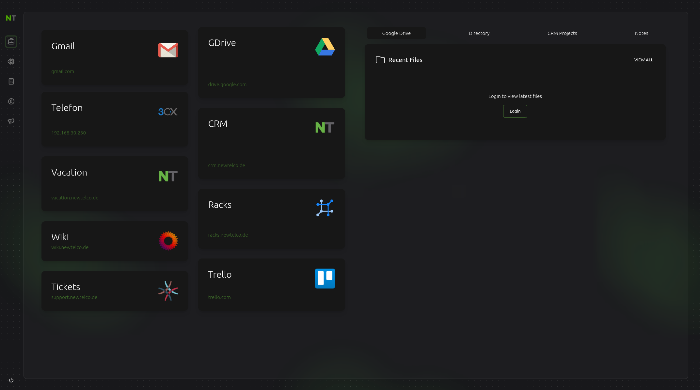

# 📰 newtelco-tab

NewTelco GmbH Intranet Homepage

## 🏁 Getting Started

1. Clone repository `git clone https://github.com/newtelco/newtelco-tab`
2. Install dependencies `cd newtelco-tab && npm install`
3. Start dev server `npm run dev`

You must have Google Credentials for the Drive / Contacts sections to work.

## 🕹️ Features

- Next.js
- Typescript
- TailwindCSS + twin.macro
- Google Workspace Integration
  - Drive Recent Files
  - Employee Directory
- CRM Recent Projects
- FaunaDB (User Notes)

## 📺 Screenshot

## 📝 License

MIT
